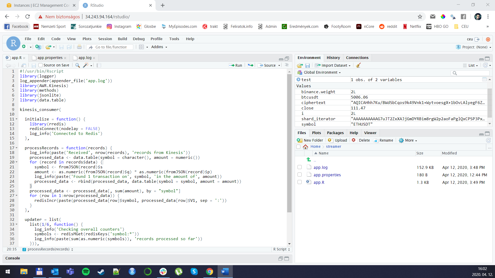

```{r setup, include=FALSE}
knitr::opts_chunk$set(echo = TRUE)
```

# Tech Setup (Instance ID: `i-0026e1085400d6372`)

I set up my EC2 instance with the following configurations:

* `de4-week3` AMI:


* `t3.small` instance type:


* `gergely-week2` IAM role:


* Added ports 8000 for alternate SSH, 8787 for RStudio and 8080 for Jenkins:


* `patrik-szigeti-assignment` security group:


* `patrik-szigeti-assignment-key` newly created key pair:


* I named my instance `patrik-szigeti-assignment-instance`, and its Instance ID is `i-0026e1085400d6372`:


* I also included ports 80 and 443 so that the shortcuts would work:


# Stream Processing Application

The instance's setup was successful, logging in to RStudio with username `ceu` and password `ceudata`:


I set up an `app.properties` file in the streamer folder, set the stream name to `CEU-Binance`, the region to Ireland (`eu-west-1`) and named my application `patrik-szigeti-assignment-app`:


I created `app.R` based on the file from the lecture with the following modifications:

* Since the task was to show the overall amount of coins exchanged on Binance per symbol in the most recent micro-batch, in addition to the `symbol`, I also had to extract the `price` (named `p` in the stream) and the `quantity` (`q`) for each transaction so that I could calculate `amount` by multiplying the two.
* I'm initiating an empty data table (`processed_data`) before the for-loop for the records in the batch.
* I'm appending each record's `symbol` and `amount` to this data table.
* After processing the records from the loop, I'm aggregating by `symbol` to get the overall traded amount for each symbol in the batch.
* Only after these steps am I calling `redisIncr` to store the aggregated values in Redis.
  



`app.log` logs all incoming batches with additional information about the received data:


# Jenkins

I created a new Jenkins job as a Freestyle project under the name `CEU-Binance Assignment` that I later renamed to `ceu-binance-assignment` to keep consistency with the naming convention I applied so far.


The script being called from Jenkins is the `overall_value.R` file which connects to Redis and creates a list from the key-value pairs that are stored in the Redis cache. As these items are coming through as a list, I have to unnest the values with `lapply`, and then cast them `as.numeric`. After dropping the original list, I'm able to aggregate the column and calculate the sum of the transactions in the last batch. The `overall_transaction_value` function takes care of the data processing and transformation, and finally prints out the overall value of the transaction in USD.


Unfortunately I kept running into a "file not found" issue in Jenkins when trying to run `Rscript /home/overall_value.R`, so I ended up pasting the whole code snippet into "Execute shell command":


The job ran successfully (after a couple of tries, this was run #20), and returned the overall value for the last batch:


# Plotting and Slack

I created two plots to post to `#bots-final-project`, but before that, I had to create a data table from the key-value pairs, and then transform the amounts that were coming through as a list to numeric values. I also cleaned up the `symbols` column a bit, and removed the `amount:` prefix that I used to store the values in Redis.

* My first plot is a bar chart showing the traded amount in the last batch in USD.
* The second plot shows a treemap of the traded amounts without the amount for `BTCUSDT`, since otherwise that would take up a significant area from the chart, and I wanted to look at the "smaller guys". For this, I also had to install the `treemapify` library to the server.


I posted both charts to the Slack channel:


# Stop the instance

And I didn't forget to stop my instance either:


